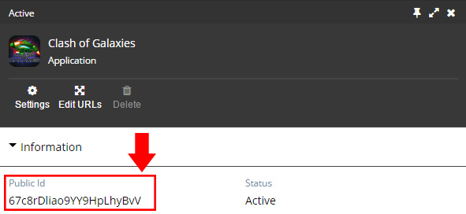

#Android SDK


AdRout's SDK provides functionality to track all App impressions, clicks, installs and other events. Our SDK is very simple to integrate, lightweight and secure. Integration will takes just 10 minutes in several simple steps.
AdRout App Tracking SDK provides easy integration of your Android app with AdRout App Tracking system.


####Requirements

•	The minimum Android OS on a specific device is Android 2.3.1 (API Version 9) 


####Download

Please, download the latest version of AdRout Tracking SDK **here** and unzip it to any folder.


####How to use it

Obtain the Application ID (Public ID) at http://dev-manage.adrout.net/. 



Go on *browse all>applications>choose your application*, in Application information you will find the Application ID. The Application ID is an unique key that helps AdRout system to track your app installs. You should use only the ID assigned to your particular application within AdRout service.

Put AdRoutTrackingSDK.jar  into /libs  folder of your project and update project dependencies according to your development environment manual.

Add install tracking code to your application's MainActivity in onCreate method using your ApplicationID:

	package ...
	import ...
	import ...
	import net.adrout.trackingsdk.AdRoutTrackingSDK
	public class MainActivity extends AppCompatActivity {
	    ...
	    protected void onCreate(Bundle savedInstanceState) {
	        super.onCreate(savedInstanceState);
	        setContentView(R.layout.activity_main);
		new AdRoutTrackingSDK(this).TrackInstall("YOUR_APP_TRACKING_ID")
	    }
	    ...
	}
	
Tracking process runs in background without delaying your UI main thread.


####App permissions

Add the INTERNET and ACCESS_NETWORK_STATE in your AndroidManifest.xml. Those two permissions are mandatory and required for SDK to run.

**AndroidManifest.xml**
```
  <!-- Include required permissions for AdRout SDK -->
  
    <uses-permission android:name="android.permission.INTERNET" />
    
    <uses-permission android:name="android.permission.ACCESS_NETWORK_STATE" />
	```
Optional permissions are ACCESS_WIFI_STATE, READ_PHONE_STATE, ACCESS_COARSE_LOCATION.

AdRout SDK will run without optional permissions, but collect less data. Additional tracking data collected from user device will result in more accurate app install analysis.

*No personal user data collected during tracking.*

```
  <!-- optional permissions -->
   
   
    <uses-permission android:name="android.permission.ACCESS_WIFI_STATE" />
   
    <uses-permission android:name="android.permission.ACCESS_COARSE_LOCATION" />
    
    <uses-permission android:name="android.permission.ACCESS_FINE_LOCATION" />
    
    <uses-permission android:name="android.permission.READ_PHONE_STATE" />
    
    
```

####Receiving GooglePlay INSTALL_REFERRER

After your application downloaded from GooglePlay Store, a Play Market app sends a broadcast message (INSTALL_REFERRER) to your app during first run. In order to process campaign and tracking information in referrer attribute, you must add a BroadcastReceiver to your application. It is recommended to use AdRout’s SDK broadcast receiver.

*Include the following code into your AdnroidManifest.xml in Application section:*

  ```
  <receiver android:name="net.adrout.trackingsdk.ReferrerReceiver"
  
            android:exported="true" android:enabled="true">
            
            <intent-filter>
            
                <action android:name="com.android.vending.INSTALL_REFERRER" />
                
            </intent-filter>
            
  </receiver>
  ```
AdRout SDK is friendly and may exist with other tracking and analysis systems SDK. If your application have multiple broadcast receivers for INSTALL_REFERRER, AdRout’s ReferrerReceiver will pass referrer attribute to other receivers.

