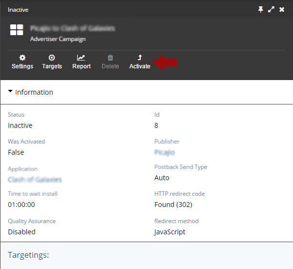

* Creation of a new advertising campaign
* Editing of the advertising company
* Adding and setting the targeting
* Activation of the advertising company

Each application can have advertising campaigns. To open the list of the advertising campaigns go to: *browse all > advertising campaigns*. To create new advertising campaign, click on the button **NEW**

####Creation of a new advertising campaign

In the creation window fill:

•	Choose your application

•	Choose your Publisher

•	Name of the advertising campaign will be generated automatically 

Click on the **CREATE** button.

####Editing of the advertising company

To continue the creation of advertising campaign, click on the **SETTINGS**.

Fill empty fields:

* **Amount of hours to wait app install** – begin from Transaction Start Event

* **Timezone offset** – All data are collected regarding the timezone and reports are generated according to timezone

* **Quality assurance** - provides with information about transactions quality. Read more

* **Postback send type** – defines the postback send type to publisher

* **Postback URL** – postback URL generated automatically by our system. Read more about Postback URL

* **Transaction Start event** – impression or redirect(click)

* **Transaction Conversion event** – app install or engagement 

* **HTTP redirect code** – it is the redirect type. Read more

* **Redirect method** – read more 

* **Cap daily conversion** - the maximum daily amount of conversions

* **Cap daily payout** - the maximum daily amount of payout

 ####Adding and setting the targeting
Each advertising  campaign can have one or several targets. You can add new targets only when your advertising campaign is inactive. 

To add new target go to: *browse all>advertising campaigns>choose your campaign> Targets>Add*

Opens the tab with targeting settings with these fields:

* **Price** - is only one for each target. Required field entry

* **Platform** – is only one for each target. Required field entry

* **Device type** - can be from 0 to 3. Not required input field

* **Languages** - may be several. Not required field

* **Country** - You can add several countries. Not required field

And click on the **SAVE** button

 ####Activation of the advertising company

To activate the advertising campaign you should go to: *browse all>advertising campaigns>choose your campaign* and you will see the panel above the information, where is the button **ACTIVATE**

After this moment, your advertising campaign will start the activation. To see the status of the campaign, you can go to the information about the application and view the status of the campaign.

