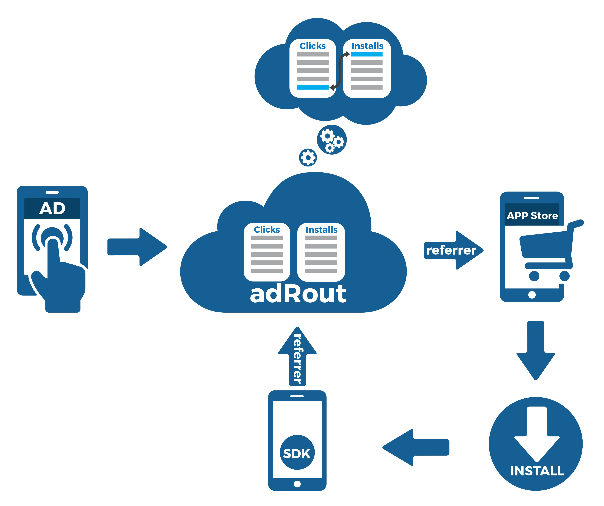
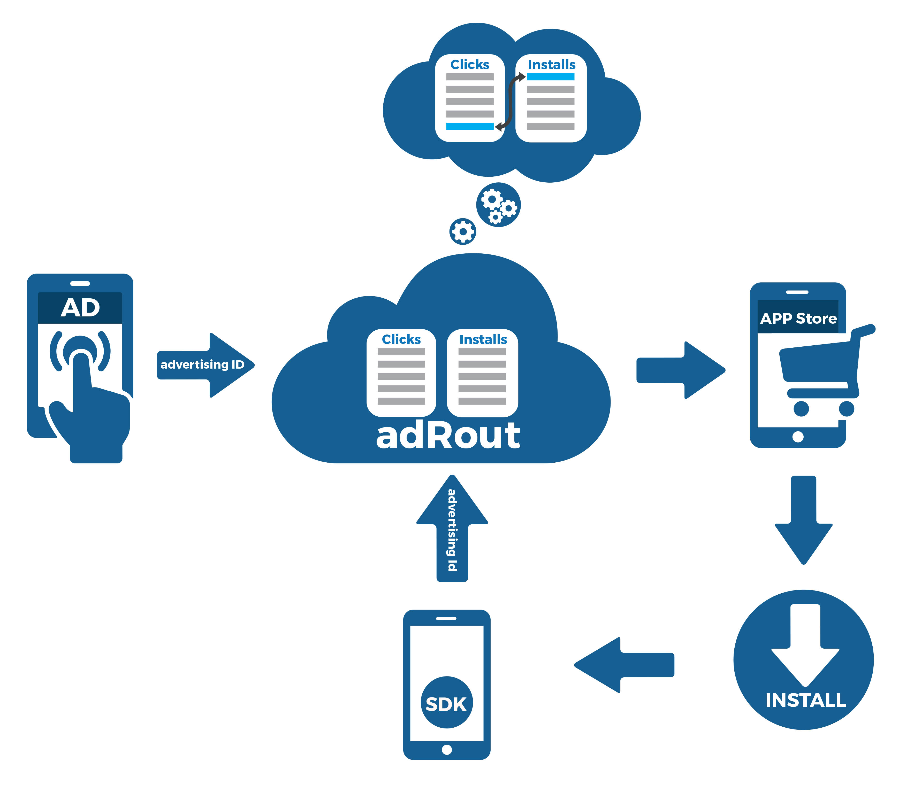
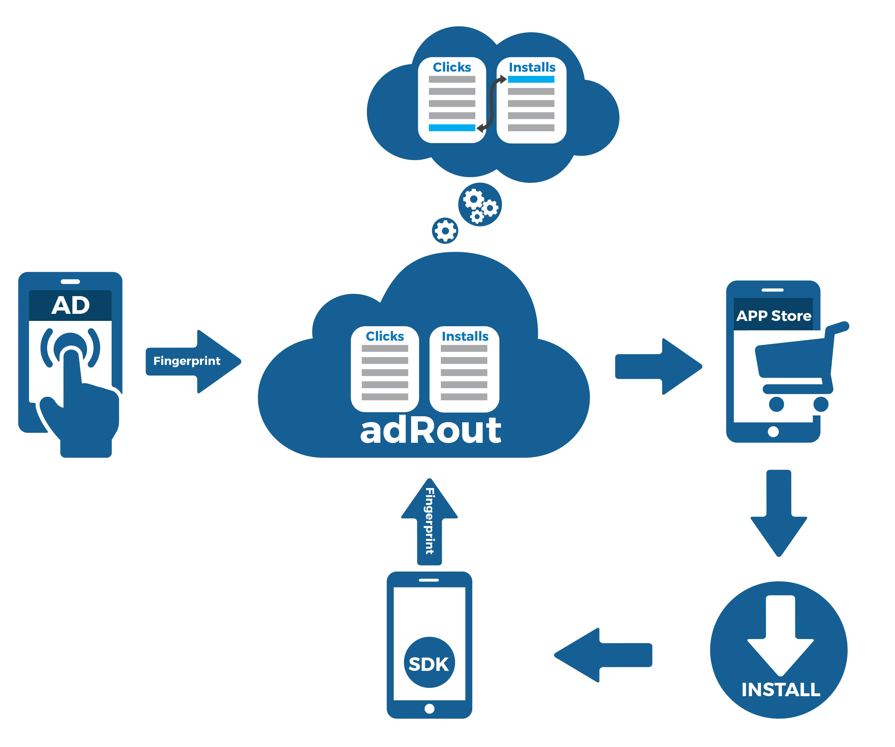

To attribute and measure the transactions (installs, clicks, impressions), AdRout App Tracking System (ATS) uses three types of attribution:

•	Store referrer 

•	Identifier matching

•	Fingerprint Matching

Requirement to these methods of attribution:

1.	SDK integration

2.	Using of tracking URL

#### 1)	Store referrer
This type of attribution used only in stores that support referrer for example (Google Play, Amazon), with app-to-app and web-to-app models. This method is one of the most reliable.

**How does it work?**

1.	User clicks on an advertisement

2.	User redirected to AdRout App tracking system

3.	User redirected to Store with help of tracking (destination) URL + referrer

4.	User install the APP

5.	When user run the APP, Store passes the referrer parameters associated with install, including transactions ID into the APP.

6.	SDK inside the APP, send to AT system data. 

7.	Our App tracking system takes the data and matching the install data with click data.

####2)	Identifier matching
This type of attribution used only in app-to-app model and in any Store you want. Identifier matching attributes with 100% accuracy.

**How does it work?**

1.	User clicks on an advertisement inside the APP

2.	User redirected to AdRout App tracking system where ATS take the user advertising ID and click ID

3.	Then user redirected to the Store and install the APP

4.	When the APP was launching, our SDK collects  the user advertising ID and passes into our ATS

5.	After that ATS matching click and install with help of the user advertising ID

####3)	Fingerprint Matching
This method used in both app-to-app and web-to-app models.

**How does it work?**

1.	User clicks on an advertisement 

2.	User redirected to AdRout App tracking system, where ATS collects data points for Device Fingerprint

3.	Then user direct to the Store and install the APP

4.	When the APP was launching, ATS SDK collects data on install for Device Fingerprint

5.	ATS matching click data with install data by device Fingerprint.

