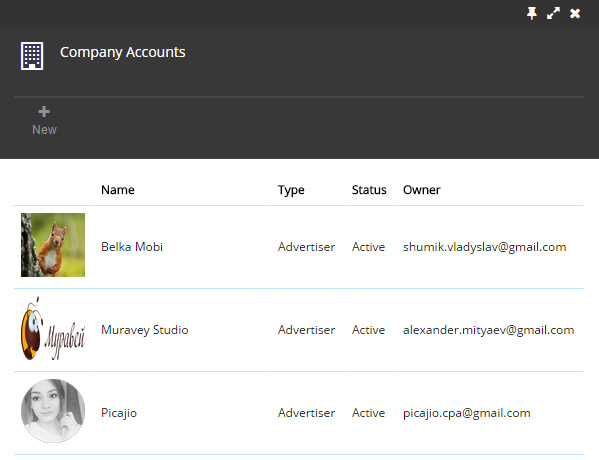

#Company account

* Account Information
* Account settings
* Account Access

####About your company account

Your account is the main source for you, from which you start your work and manage the settings.
Each user could have several accounts. Your account can be personal or shared. 

To see the list of the accounts, please follow : *browse all > accounts*. 

Here you could see all your accounts. When you click on it, you can see the account information, where you can click on Settings button and edit the information about account. If you have several accounts, you could swap them in your account information. If you click on the Access button, you could see there all shared accounts or create new one. Your account could be as Advertiser or as Publisher.

* 
####Account Information

In the account information, you could see:

**Status** – Active or Inactive 

**Type** – Publisher or Advertiser

**Public Id** – is the public identifier for your company. Requirements: from 3 to 63 letters, hyphens and numbers allowed.

**Owner** – shows the owner e-mail

**Permissions** – shows the type of access to account. There are 3 types of permission: owner, edit, read

**Description** – where you could put useful information about your company

And **detailed information** : address, city, zip code, phone, skype and website.

* 
 ####Account settings

In account settings you have an opportunity to edit the account information, name of account and it’s description.
If your account is acting as *Publisher*, you should set the  [Postback URL] (http://docs.adrout.net/gen/postback-URL.html "Postback URL"). 

* ####Account Access
Each account owner have an opportunity to provide an access to account. To do this, you should follow: *browse all > accounts > choose your account > access*

In this section, you can see who can access your shared account. Also, you can create a new access to your account. You need an e-mail of the person and to choose the type of the access.
