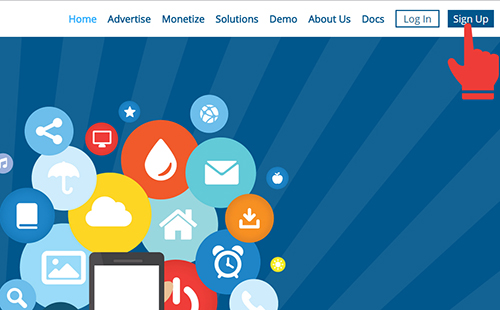
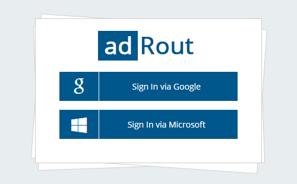
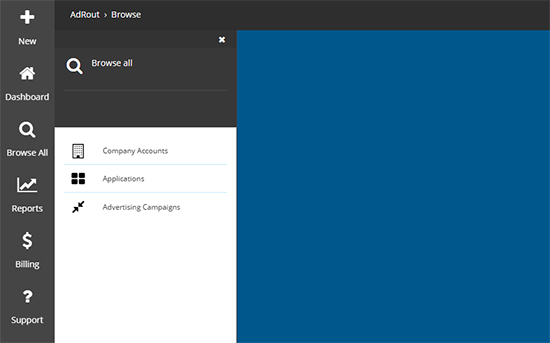

####How to start working with our system?

1.Sign up in our website

2.When account manager will approve your account, we provide you an access to our system.

3.When you will get into the system, click on Browse all. Here you can see company accounts, applications and advertiser campaigns, advertiser and publisher offers.

4.Open *company accounts>choose your account>settings* and fill empty fields with company information [Read more about company account](http://docs.adrout.net/gen/gen-1-1-Company-Account.html "Read more")

5.Open Applications > New and create new application [Read more about applications](/applications.html)

6.To start advertising campaign, go to *browse all > advertising campaigns and Create new advertising campaign [Read more about advertising campaigns](http://docs.adrout.net/gen/1-2-Applications.html "Read more")

7.TO run the advertising campaign you have to implement the adRout's SDK into your APP, [Read more about SDK](http://docs.adrout.net/sdk/Android-SDK.html "Read more")