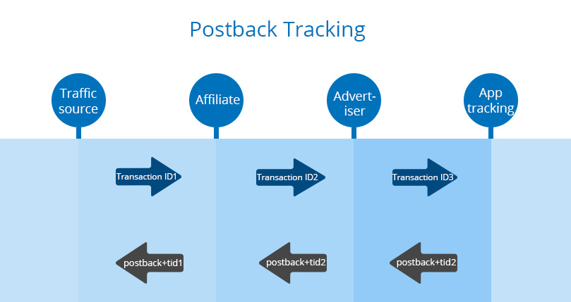

####Postback Fraud

**What is Postback?**

Postback is one of the most reliable and quick way of tracking conversions. Postback is an URL that directs from the app tracking system to other participants in the chain (such as advertiser, affiliate network and traffic source). In addition, you have an opportunity to add parameters to the postback URL, which helps to identify some kind of interesting information.

