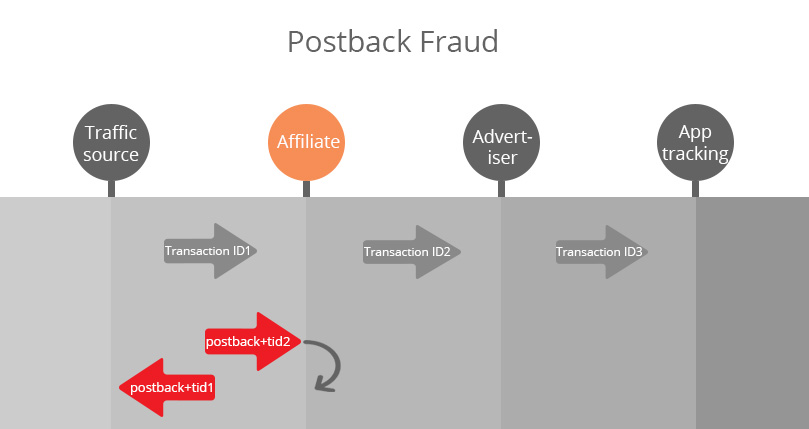
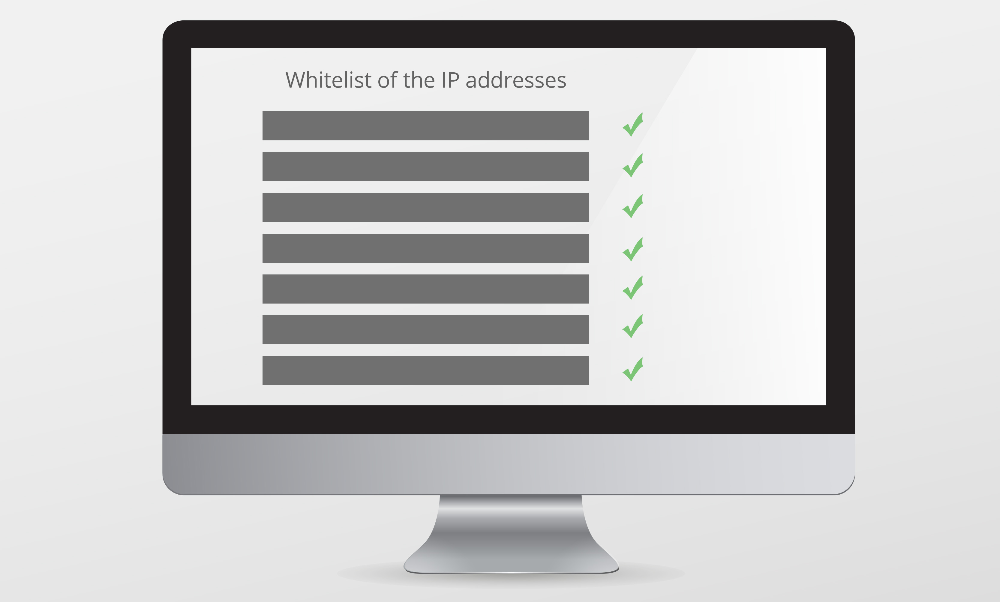

#Postback Fraud

###What is Postback?

Postback is one of the most reliable and quick way of tracking conversions. Postback is an URL that directs from the app tracking system to other participants in the chain (such as advertiser, affiliate network and traffic source). In addition, you have an opportunity to add parameters to the postback URL, which helps to identify some kind of interesting information.

###What is Postback Fraud?

Postback Fraud – is when the Traffic Source trying your app tracking system to count the conversion, while this conversion wasn’t really exist. In this case, scammers know where they could get the transaction ID and where they have to send the postback without advertiser approve. In this way, scammers automatically generate the transaction ID and send the postback to the end point of your system and therefore the advertiser doesn’t see the transaction.

###There are several approaches how to fight with postback fraud:

##### 1. Whitelist of the IP addresses of the advertiser platform. 

The Whitelist is a list of IP addresses. When a postback is received from an IP address, it is compared with the whitelist. 
This approach helps pretty easy to fight with scammers, but it has several issues:

**1)**	Wide range of IP addresses. It means that these ranges could be very wide and fully belong to the large hosting provider (such as Amazon, Azure) and sometimes scammers can get into this range.

**2)**	You need to keep them up to date all the time. It means that IP address could often changes and you should always update whitelist. 

##### 2. Our solution

Our system creates a secret key, as a string, that is uniquely created for the Advertiser. This secret key is added, when you configure a postback. In this case, a postback is sent with secret key to our server. Then the system match them and if secret keys are the same, the system counts the postback. 

First, you need to configure for each campaign a unique key. We recommend using 128 bit base-64 encoded unique key. After that, when you will set a postback on the advertiser side, you have to add this secret key. When a postback is sent, our system will check the secret keys on the both sides and if they match, the event will be counted.