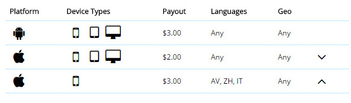
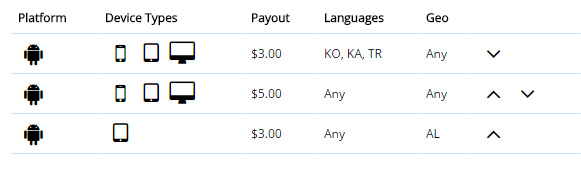
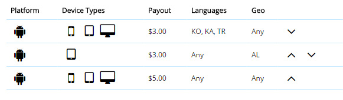

#Targets

### Pay attention, please!

When you add more than one target in the advertising campaign, it is important in which order you place the targets, and it affects on which of the targets will be counted.

##### Let’s consider the situation in the examples:

1)	In this case, if the person with the iPhone with the languages of the group: AV, ZH, IT  make the conversion, it will be counted in the second targeting. Because in second target the language is ANY and this target is above 3d target. So, if you want to change the situation, put 3d target above 2nd. 

2) In this case, if person using the iPhone  with the languages of this group : AV, ZH, IT  make the conversion, it will be counted in the second targeting.

3) In this case, first target will be counted only if person will have android device, with language : KO, KA, TR. 

And if person will use tablet, with all geo and with any languages except  KO, KA, TR, second target will be counted.

4) In this case, 3d target never will be counted. 2nd target will be counted if person would use any languages except  KO, KA, TR

To change the situation, you have to put 3d target above the 2nd.

