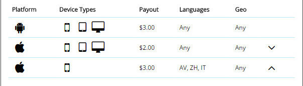
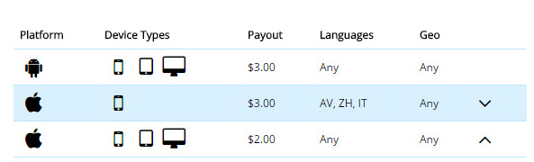
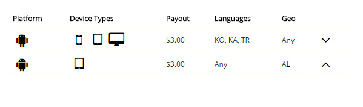

#Targets

### Pay attention, please!

When you add more than one target in the advertising campaign, it is important in which order you place the targets, and it affects on which of the targets will be counted.

##### Let’s consider the situation in the examples:

1)	In this case, if the person with the iPhone with the languages of the group: AV, ZH, IT  make the conversion, it will be counted in the second targeting. Because in second target the language is ANY and this target is above 3d target. So, if you want to change the situation, put 3d target above 2nd. 

2) In this case, if person using the iPhone and with the languages og this group : AV, ZH, IT  make the conversion, it will be counted in the second targeting.

3)